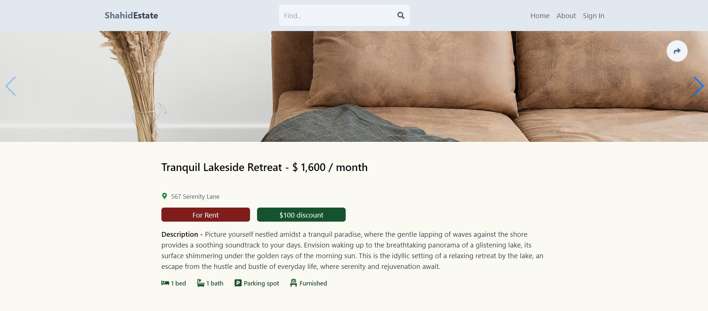

<a name="readme-top"></a>

# 📗 Table of Contents

- [📖 About the Project](#about-project)
  - [🛠 Built With](#built-with)
    - [Tech Stack](#tech-stack)
  - [💻 Getting Started](#getting-started)
  - [Setup](#setup)
  - [Prerequisites](#prerequisites)
  - [Deployment](#deployment)
- [👥 Authors](#authors)
- [🔭 Future Features](#future-features)
- [🤝 Contributing](#contributing)
- [⭐️ Show your support](#support)
- [🙏 Acknowledgements](#acknowledgements)
- [📝 License](#license)

<!-- PROJECT DESCRIPTION -->

# 📖 Shahid Estate <a name="about-project"></a>

Shahid Estate: A MERN stack project that builds a modern real estate marketplace application. The application includes features like user authentication, property listings, search, and more. The project is deployed to Vercel.
<a href="https://real-estate-frontend-lyart.vercel.app/"></a>

## 🛠 Built With <a name="built-with"></a>

### Tech Stack <a name="tech-stack"></a>


<details>
  <summary>Client</summary>
  <ul>
    <li><a href="https://developer.mozilla.org/en-US/docs/Web/HTML">React</a></li>
    <li><a href="https://developer.mozilla.org/en-US/docs/Web/HTML">Tailwing</a></li>
    <li><a href="https://developer.mozilla.org/en-US/docs/Web/HTML">Typescript</a></li>
    <li><a href="https://developer.mozilla.org/en-US/docs/Web/HTML">Redux</a></li>
    <li><a href="https://developer.mozilla.org/en-US/docs/Web/CSS">CSS</a></li>
  </ul>
</details>

<details>
  <summary>Server</summary>
  <ul>
    <li>Firebase</li>
    <li>Nodejs</li>
  </ul>
</details>

<details>
<summary>Database</summary>
  <ul>
    <li>MongoDB</li>
  </ul>
</details>

<!-- Features -->

<!-- LIVE DEMO -->

## 💻 Getting Started <a name="getting-started"></a>

To get a local copy up and running, follow these steps.

### Prerequisites

In order to run this project you need:

- You need to have NodeJS installed
- A Web Browser (Google Chrome, Firefox, etc)
- A Code Editor (Notepad++, VSCode, etc)

### Setup

Clone this repository to your desired folder:

```sh
  cd my-folder
  git https://github.com/Shahid-Bagwan/real_estate
```


### Install

Install this project with:

```sh
  cd api
  npm install
  cd client
  npm install
```
### Deployment

You can deploy this project using:

Deploy this project on any websever

<p align="right">(<a href="#readme-top">back to top</a>)</p>

## 👥 Authors <a name="authors"></a>

👤 **Shahid Bagwan**

- GitHub: [@ShahidBagwan](https://github.com/Shahid-Bagwan)

<p align="right">(<a href="#readme-top">back to top</a>)</p>

## 🔭 Future Features <a name="future-features"></a>

- [ ] **showcase project which i have done.**

<p align="right">(<a href="#readme-top">back to top</a>)</p>

## 🤝 Contributing <a name="contributing"></a>

Contributions, issues, and feature requests are welcome!

Feel free to check the [issues page](https://github.com/Shahid-Bagwan/real_estate/issues).

<p align="right">(<a href="#readme-top">back to top</a>)</p>

## ⭐️ Show your support <a name="support"></a>

If you like this project give me a star.

<p align="right">(<a href="#readme-top">back to top</a>)</p>

## 🙏 Acknowledgments <a name="acknowledgements"></a>

I would like to thank every who continues supporting me.

<p align="right">(<a href="#readme-top">back to top</a>)</p>

## 📝 License <a name="license"></a>

- [License](./LICENSE)

<p align="right">(<a href="#readme-top">back to top</a>)</p>
